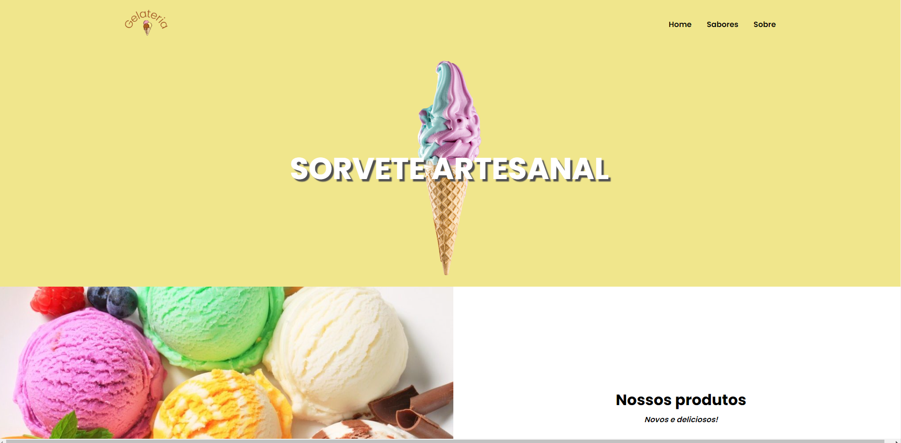
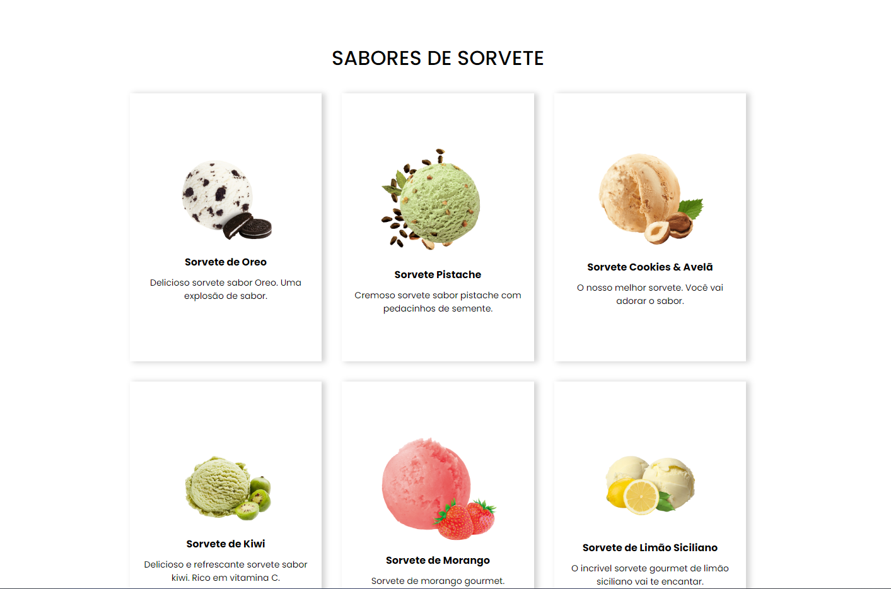
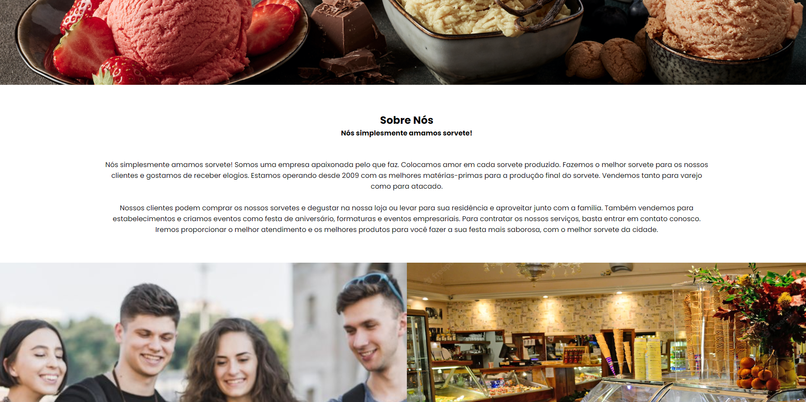

<html>

# Projeto Sorveteria

- Esse projeto, foi desenvolvido para testar minhas habilidades em organização,como clean code, uso correto de tags semânticas, o uso de Rotas e responsividade.

- Página sabores, você irá encontrar, sabores de sorvetes como OREO, KIWI etc.

- Página sobre, você terá acesso ao endereço, localização e número para contato.

- DIFICULDADES: Não ouve dificuldades para desenvolver nenhuma parte do projeto.

- Projeto copiado do curso DEV-MEDIA, mas todo códificado por min sem utilizar nenhum auxílio do curso.

- FERRAMETAS UTILIZADAS:

  - Biblioteca REACT JS.
  - Styled-componenents na estilização.
  - React Router (SPA), para navegação de páginas internas.

    
    

        
        
    
      
    <a href="https://sorveteria-seven.vercel.app/Flavors" style="padding: 10px 15px; background-color: #F5DEB3; border: 1px solid #000; border-radius: 10px; color: #000; text-decoration: none">Navegue até o projeto.</a>
    

    
    </html>
